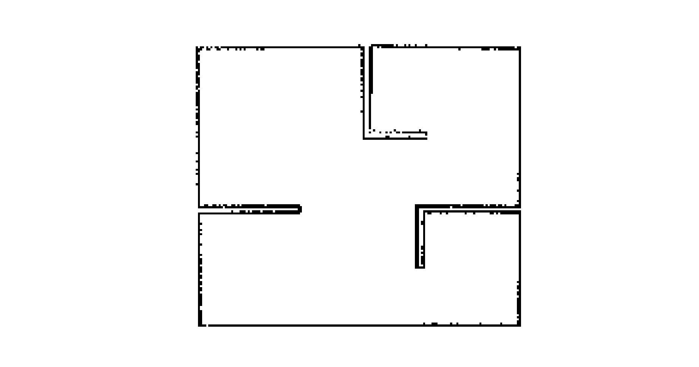

# AMR Final Project

This repository hosts the source code for the final project at the Autonomous Mobile Robots (AMR) course. Our work encapsulates the integration of sophisticated navigation capabilities on the Robile platform, including path planning, localization, and environment exploration utilizing ROS2 and custom-developed algorithms.

## Project Structure and Overview

- `assets/`: Contains visual resources and diagrams, such as `amr-simulation-map.png`, which illustrate the simulated environment and help in visualizing the robot's operational context.  
- `src/`: The core of our project, structured into specific modules for organization and clarity:
  - `common/`: Defines shared resources across the project, including constants and utility functions that form the backbone of our navigation algorithms.
  - `services/`: Houses the core functionalities crucial to Robile's navigation and exploration capabilities:
    - `astar_service.py`: Implements the A* algorithm, enabling global path planning by finding the most efficient path between two points.
    - `exploration_service.py`: Manages the strategy for autonomous exploration, allowing Robile to intelligently navigate and map unknown environments.
    - `frontier_service.py`: Focuses on detecting and managing frontiers, which are boundaries between explored and unexplored areas, facilitating systematic exploration.
    - `localization_service.py`: Implements a custom particle filter algorithm for precise localization, using sensor data to accurately estimate Robile's position within its environment.
    - `path_planning_service.py`: Provides mechanisms for dynamic path planning, integrating various algorithms to navigate efficiently while avoiding obstacles.
    - `potential_field_service.py`: Utilizes the potential field method for local navigation, directing the robot away from obstacles and towards its goal through simulated forces.
- `utils/`: Supports the main services with additional utilities like an event bus system for inter-component communication.
  
- `test/`: Contains unit tests for validating the functionality and reliability of our algorithms and utilities, ensuring robustness and efficiency in the system's operations.
  
- `main.py`: Serves as the entry point to our application, orchestrating the initialization and interaction of various components within the system.

## Usage (Development & Simulation)

### Prerequisites

In order to use this project, make sure the following prerequisites are met:

1. OS: Ubuntu 22.04 LTS
2. Python (tested on Python 3.10.12)
3. ROS2 and Robile-related setup (use [these](https://gist.github.com/Elektra-V/74e241c97843efe6a5a0cc8e60067bca) Bash scripts)
4. VSCode, alongside [Python](https://marketplace.visualstudio.com/items?itemName=ms-python.python) and [ROS](https://marketplace.visualstudio.com/items?itemName=ms-iot.vscode-ros) extensions

Next, create a `settings.json` file in `.vscode` folder:

```json
{
    "python.autoComplete.extraPaths": [
        "/opt/ros/humble/lib/python3.10/site-packages",
        "/opt/ros/humble/local/lib/python3.10/dist-packages"
    ],
    "python.analysis.extraPaths": [
        "/opt/ros/humble/lib/python3.10/site-packages",
        "/opt/ros/humble/local/lib/python3.10/dist-packages"
    ],
    "ros.distro": "humble"
}
```

This will ensure access to autocompletion and source code analysis, and it will configure the ROS extension. If needed, reload the window.

Remember to always source ROS2 and potentially also the the `ros2_ws` workspace (when launching Robile in simulation).

```bash
source /opt/ros/humble/setup.bash

# Only when running Robile in simulation
source ~/ros2_ws/install/setup.bash
```

### Running on Robile

Our design of the project is simple: first explore the environment and build a map, and then, using the generated map, we manually provide start/goal, and let the robot find its way.

#### Exploration mode

In the first terminal window, launch Robile in simulation (refer to command above). For the exploration mode to work, make sure you set the following environment variable BEFORE launching the program:

```bash
export EXPLORATION=true
python3 main.py
```

#### Finding the goal mode

In the first terminal window, launch Robile in simulation (refer to command above). In the second terminal window, launch the program:

```bash
python3 main.py
```

You will need to start the map server and then configure + activate it. For that, first start the server:

```bash
cd maps
ros2 run nav2_map_server map_server --ros-args -p yaml_filename:="my_map.yaml"
```

To configure and activate the map server, in another terminal window, execute the following:

```bash
ros2 lifecycle set /map_server configure
ros2 lifecycle set /map_server activate
```

## Testing

In order to run tests (they should all be in the `test` folder), you will need to set the `PYTHONPATH` variable in order for Python to be able to correctly resolve module imports.

```bash
source /opt/ros/humble/setup.bash
export PYTHONPATH="${pwd}:$PYTHONPATH"
```

Do not use the `unittest` library module, instead, run test files as normal Python programs.

### Setup: Creating a Map For Testing

You would hopefully only need to go through this step once. In order to create a map, it's important to following the following instructions.

1. In the first terminal window, launch Robile in simulation

```bash
ros2 launch robile_gazebo gazebo_4_wheel.launch.py
```

2. In the second terminal window, start Navigation 2 stack and use the Gazebo time (simulated time)

```bash
ros2 launch nav2_bringup navigation_launch.py use_sim_time:=True
```

3. In the third terminal window, start `slam_toolbox`, and once again, use the simulated time

```bash
ros2 launch slam_toolbox online_async_launch.py use_sim_time:=True
```

4. In the fourth terminal window, launch RViz so that you can have an idea of how map is being created.

```bash
ros2 run rviz2 rviz2 -d /opt/ros/humble/share/nav2_bringup/rviz/nav2_default_view.rviz
```

5. In the fifth terminal window, launch this command in order to be able to control the robot with a keyboard

```bash
ros2 run teleop_twist_keyboard teleop_twist_keyboard
```

6. Move the robot around and attempt to create an accurate map. When done, open the sixth terminal window and enter the following command to save the map (this does it in `my_map`):

```bash
ros2 run nav2_map_server map_saver_cli -f my_map
```

This will create two files, the actual map file (.pgm file) and its description (YAML file). Create a folder called `maps` and copy-paste them inside (we are not checking in the maps into version control).

If done properly, your map should look something like this:


